# 并发&并行
## 概念
并发（concurrent）： 单核CPU在不同线程之间跳转并且执行线程的指令，这种就是并发  
并行（parallel）： 双核甚至多核CPU，同时执行不同线程的指令，这叫做并行

## 注意
多线程执行只有在多核CPU下才能提高效率，在单核CPU下面还是串型执行

# 进程/线程相关
## 创建线程
### 方法1  
使用Thread类进行创建，new Thread时会创建其子类，子类的run方法执行线程逻辑。
无返回值，无异常抛出  
[方法 1](./src/main/java/org/example/createthread/CreateThread1.java)  

### 方法2   
使用Thread创建线程，使用runnable接口创建任务，runnable接口new的时候会创建实现类，实现run方法
把task和thread对象组合起来进行线程逻辑执行  
[方法 2](./src/main/java/org/example/createthread/CreateThread2.java)

### 方法3  
使用Thread创建线程，使用FutureTask + Callable接口创建又返回值和异常抛出的任务，
把线程和任务组合起来执行线程逻辑。为了获取task的返回接口，主线程会等待，知道task线程执行完并且返回  
[方法 3](./src/main/java/org/example/createthread/CreateThread3.java)

## 查看进程/线程
### 查看所有进程
```shell
# command
ps -ef
ps -ef | grep 关键字

# output：
  501 96282     1   0 10:58PM ??         0:00.33 /System/Applications/Utilities/Terminal.app/Contents/MacOS/Terminal
  501 94836  1011   0 Wed10PM ttys000    0:00.06 /bin/zsh --login -i
    0 96283 96282   0 10:58PM ttys002    0:00.01 login -pf liangxiaole
  501 96284 96283   0 10:58PM ttys002    0:00.02 -zsh
    0 96295 96284   0 10:58PM ttys002    0:00.00 ps -fe
```

### 使用jvm的命令查看进程 & 杀死进程
```shell
# command, 只查看java进程
jps

# output，前面的数字就是pid
96355 Jps
1011 
96069 Launcher

# 杀死进程，pid就是上面查出来的那穿数字
kill pid
kill 96355
```

### 动态显示进程/线程信息
```shell
# command 动态显示所有进程信息
top 

# output, 会动态刷新
PID    COMMAND      %CPU TIME     #TH    #WQ  #PORT MEM    PURG  CMPRS PGRP  PPID  STATE    BOOSTS           %CPU_ME %CPU_OTHRS UID  FAULTS    COW    MSGSENT     MSGRECV     SYSBSD      SYSMACH
93942  Google Chrom 37.3 55:09.52 23/1   1    338+  2353M+ 0B    41M   1003  1003  running  *0[613]          0.00000 0.00000    501  2741015+  1067   12036692+   4775231+    44087148+   26315074+
175    WindowServer 26.8 28:15:10 27     5    3480- 813M-  43M+  98M   175   1     stuck    *0[1]            1.42297 0.58395    88   89131383+ 581001 770610822+  684693773+  1243187730+ 2147483647
14760  Microsoft Ed 22.7 78:00.09 23/1   1    215   89M-   0B    11M   1025  1025  running  *0[8910]         0.00000 0.00000    501  296099    972    41639236+   15510314+   46888263+   87341388+
0      kernel_task  15.0 19:22:15 611/10 0    0     54M    0B    0B    0     0     running   0[0]            0.00000 0.00000    0    107501    0      1354146861+ 1001571010+ 0           0
1205   Google Chrom 11.2 18:05:26 25     5    313   279M+  37M   16M   1003  1003  sleeping *1[2]            0.12355 0.00000    501  49519620+ 5105   692334459+  325883364+  575235773+  1637356445+
96282  Terminal     10.3 00:04.25 8      3    300-  129M+  24M-  0B    96282 1     sleeping *0[96]           0.08909 0.79563    501  18586+    289    48181+      10888+      41715+      108169+
96375  top          7.3  00:00.80 1/1    0    27    10M+   0B    0B    96375 96284 running  *0[1]            0.00000 0.00000    0    5733+     87     940594+     470291+     25560+      507648+
1015   WeChat       4.9  02:23:22 51     15   1686  570M   0B    127M  1015  1     sleeping *0[75979]        0.15107 0.62858    501  21352342+ 1184   695352583+  338265341+  70810257+   1064551288+
1011   idea         4.2  07:29:22 177    5    942   3588M  75M   396M  1011  1     sleeping *0[28303]        0.00000 0.00000    501  6827260+  7135   35671510+   6132786     1433735235+ 218924487+
1

# 查看某个进程里面的线程, -H 查看线程 -p查看某个进程的线程
top -H -p pid
top -H -p 96388
```

### 某个时刻jvm的进程信息
```shell
jstack pid
```

### jconsole 图形化进程/线程查看工具
直接数据jconsole命令即可打开，也可以远程连接查看jvm信息
  
 

## 栈和栈桢
JVM由堆，栈，方法区组成。其中栈内存给线程使用，每个线程启动的时候，虚拟机就会为其分配一块栈内存  
- 每个栈由多个栈桢（frame）组成，对应每次调用方法时候所栈用的内存
- 每个线程只能有一个活动栈桢，对应当前正在执行的方法
 

## 线程方法

### 线程方法总结

Thread 类 API：  

| 方法                                          | 说明                                                               |
|---------------------------------------------|------------------------------------------------------------------|
| public void start()                         | 启动一个新线程，Java虚拟机调用此线程的 run 方法                                     |
| public void run()                           | 线程启动后调用该方法                                                       |
| public void setName(String name)            | 给当前线程取名字                                                         |
| public void getName()                       | 获取当前线程的名字<br />线程存在默认名称：子线程是 Thread-索引，主线程是 main                 |
| public static Thread currentThread()        | 获取当前线程对象，代码在哪个线程中执行                                              |
| public static void sleep(long time)         | 让当前线程休眠多少毫秒再继续执行<br />**Thread.sleep(0)** : 让操作系统立刻重新进行一次 CPU 竞争 |
| public static native void yield()           | 提示线程调度器让出当前线程对 CPU 的使用                                           |
| public final int getPriority()              | 返回此线程的优先级                                                        |
| public final void setPriority(int priority) | 更改此线程的优先级，常用 1 5 10                                              |
| public void interrupt()                     | 中断这个线程，异常处理机制                                                    |
| public static boolean interrupted()         | 判断当前线程是否被打断，清除打断标记                                               |
| public boolean isInterrupted()              | 判断当前线程是否被打断，不清除打断标记                                              |
| public final void join()                    | 等待这个线程结束，比如主线程想要拿到t1线程的结果，主线程调用这个方法后会等待t1线程执行完                   |
| public final void join(long millis)         | 等待这个线程死亡 millis 毫秒，0 意味着永远等待                                     |
| public final native boolean isAlive()       | 线程是否存活（还没有运行完毕）                                                  |
| public final void setDaemon(boolean on)     | 将此线程标记为守护线程或用户线程                                                 |

### 方法详解  
#### Start & Run 方法
- run：称为线程体，包含了要执行的这个线程的内容，方法运行结束，此线程随即终止。直接调用 run 是在主线程中执行了 run，没有启动新的线程，需要顺序执行  
- start：使用 start 是启动新的线程，此线程处于就绪（可运行）状态，通过新的线程间接执行 run 中的代码

[Start And Run](./src/main/java/org/example/threadmethod/StartAndRun.java)  

### Sleep & Yield
- sleep：
  - 调用 sleep 会让当前线程从 Running 进入 Timed Waiting 状态（阻塞）
  - sleep() 方法的过程中，线程不会释放对象锁
  - 其它线程可以使用 interrupt 方法打断正在睡眠的线程，这时 sleep 方法会抛出 InterruptedException
  - 睡眠结束后的线程未必会立刻得到执行，需要抢占 CPU
  - 建议用 TimeUnit 的 sleep 代替 Thread 的 sleep 来获得更好的可读性
- yield(Thread.yield())：
  - 调用 yield 会让当前线程从Running进入Runnable状态，然后调度器执行其他线程
  - 具体的实现依赖于操作系统的任务调度器
  - 会放弃 CPU 资源，锁资源不会释放
- [Start And Run Code](./src/main/java/org/example/threadmethod/SleepAndYield.java)

### 线程优先级
- 线程优先级会提示调度器，优先调度该线程。但这仅仅是一个提示，调度器可以忽略
- 如果cpu比较忙，那么优先级高的的线程会获得更多的时间便，但是cpu闲时，优先级几乎没用

### Sleep防止CPU使用率100%
可以在死循环中加入sleep或者yield，让循环不要空转，可以把cpu让渡出来给其他的程序使用
```diff
while (true) {
  try {
+   Thread.sleep(2);
  } catch (Exception ex) {
    ex.printStackTrace();
  }
}
```

### Join 等待线程执行结束
在主线程中调用t1.join()方法，主线成会等待t1线程执行结束之后，再继续执行  
[Join](./src/main/java/org/example/threadmethod/JoinDemo.java)

### Interrupt 线程
主线程打断其他线程的时候，会把被打断线程的打断标记标记标记为true。 但如果被打断他线程是处在阻塞状态（sleep， wait， join）的话
，执行interrupt方法，会出现异常，打断标记会是false
[Join](./src/main/java/org/example/threadmethod/InterruptDemo.java)

### 2阶段终止模式  
一个线程终止另一个线程的设计模式
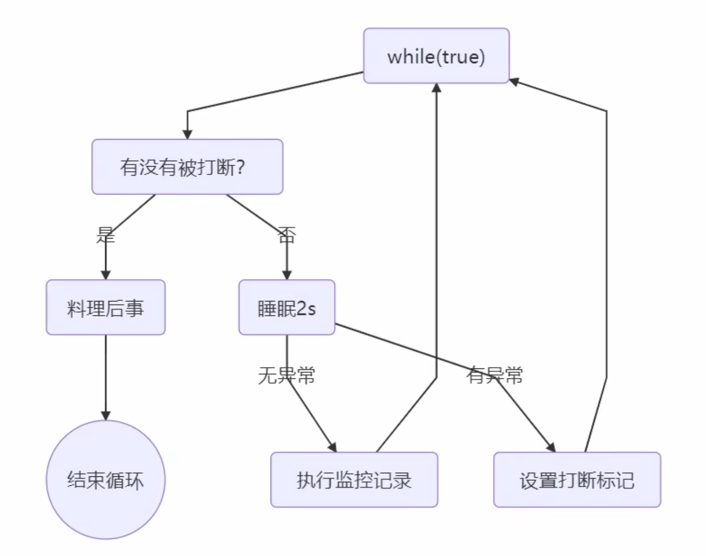
[2 phase termination](./src/main/java/org/example/threadmethod/TwoPhaseTermination.java)

### LockSupport.part & Thread.interrupted
- LockSupport.park: 让正在执行的线程停止执行，类似sleep，但是没有时间。 同时有一个特点：当打断状态是true的时候，不会生效
- Thread.interrupted： 会返回当前线程的打断状态，然后清除打断状态
[LockSupport](./src/main/java/org/example/threadmethod/LockSupport.java)

## 主线程&守护线程
默认情况下，java进程需要等待所有线程执行结束以后，才会结束。  
有一种特殊的线程叫做守护线程，当其他的所有非守护线程运行结束了，即使守护线程没有执行完，也会强制结束。  
[Main and Demon](./src/main/java/org/example/threadmethod/MainAndDemon.java)


## 线程状态
### 5种状态（操作系统层面）
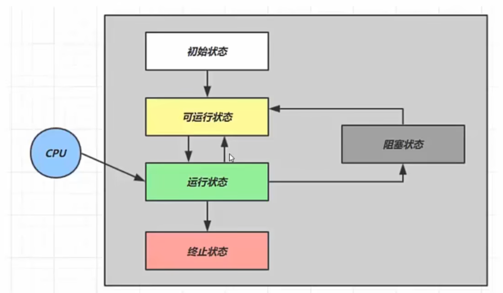 

### 6种状态（根据Thread.State枚举类， java层面）
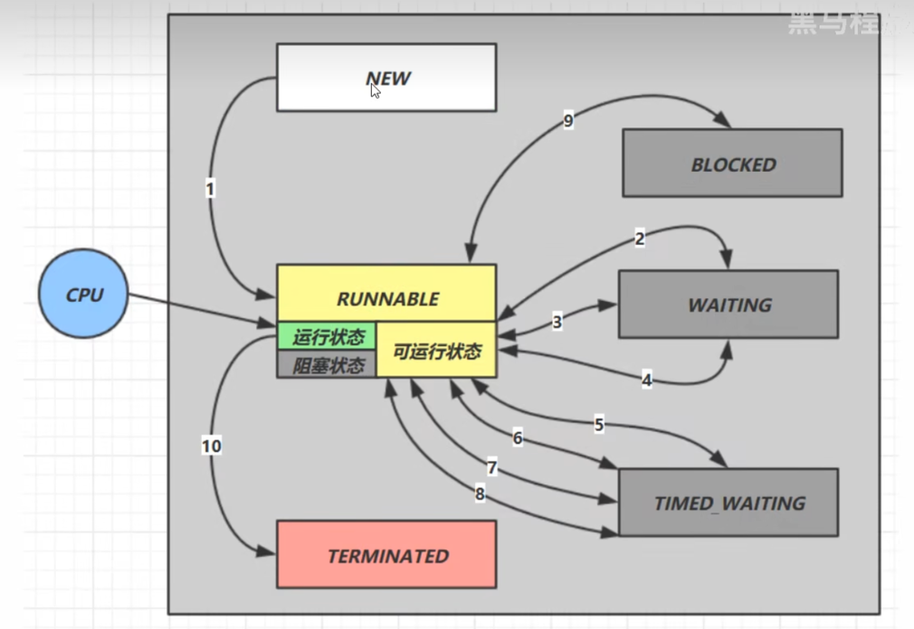   
[6 thread state](./src/main/java/org/example/threadmethod/SixThreadState.java)


# 共享模型之管程
## Synchronized 
加在方法上，相当于锁住了this对象
```diff
public synchronized void demo() {
    
}

等价于

synchronized(this) {
    
}
```

加载静态方法上，相当于锁住了类对象
```diff
public synchronized static void demo() {
    
}

等价于

synchronized(Test.clas) {
    
}
```

# Monitor 概念
## Java 对象头
以32位虚拟机为例子  

普通对象  
一个int 4个字节，一个Integer=对象头+value = 12个字节。KlassWord是一个指针，指向了这个对象的类型。
一个对象是什么类型就是靠对象头的klass word来表示的
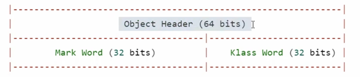

数组对象
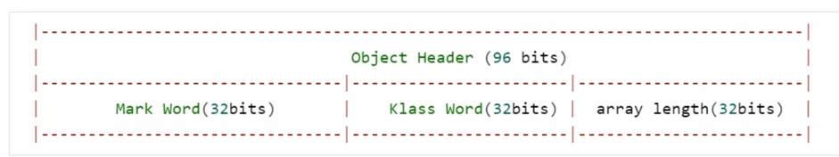

Markword结构
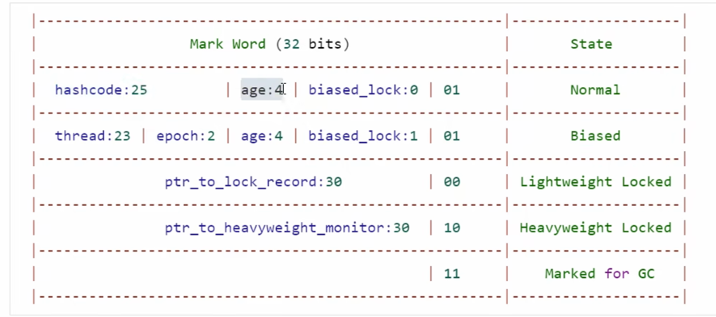

## Monitor
### 图解monitor
被翻译成监视器或者管程，java中的每个对象都可以管理一个monitor对象（由操作系统提供），当执行synchronized代码块（重量级锁）时候，java中对象
的markwork会执行monitor对象  
加锁的过程就是：
上图中的normal ->  ptr_to_heavyweight_monitor  
***ps:这里有一个细节，上述变化，java对象中的hashcode，age之类的信息会存入Monitor对象中***
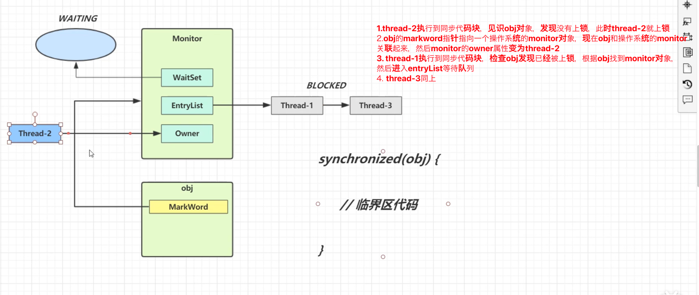
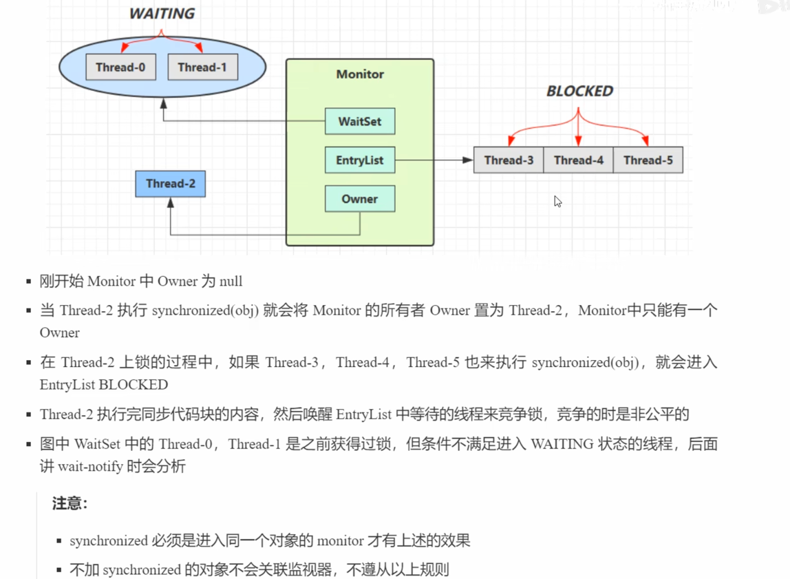

### 解锁
- 在 Thread-2 上锁的过程，Thread-3、Thread-4、Thread-5 也执行 synchronized(obj)，就会进入 EntryList BLOCKED（双向链表）
- Thread-2 执行完同步代码块的内容，根据obj对象头中 Monitor 地址寻找，设置 Owner 为空，把线程栈的锁记录中的对象头的值设置回 MarkWord
- 唤醒 EntryList 中等待的线程来竞争锁，竞争是非公平的，如果这时有新的线程想要获取锁，可能直接就抢占到了，阻塞队列的线程就会继续阻塞
- WaitSet 中的 Thread-0，是以前获得过锁，但条件不满足进入 WAITING 状态的线程（wait-notify 机制）

注意：
- synchronized 必须是进入同一个对象的 Monitor 才有上述的效果
- 不加 synchronized 的对象不会关联监视器，不遵从以上规则

### 字节码解释monitor
```diff
public static void main(String[] args) {
    Object lock = new Object();
    synchronized (lock) {
        System.out.println("ok");
    }
}
```
```diff
0: 	new				#2		// new Object
3: 	dup
4: 	invokespecial 	#1 		// invokespecial <init>:()V，非虚方法
7: 	astore_1 				// lock引用 -> lock
8: 	aload_1					// lock （synchronized开始）
9: 	dup						// 一份用来初始化，一份用来引用
10: astore_2 				// lock引用 -> slot 2
11: monitorenter 			// 【将 lock对象 MarkWord 置为 Monitor 指针】
12: getstatic 		#3		// System.out
15: ldc 			#4		// "ok"
17: invokevirtual 	#5 		// invokevirtual println:(Ljava/lang/String;)V
20: aload_2 				// slot 2(lock引用)
21: monitorexit 			// 【将 lock对象 MarkWord 重置, 唤醒 EntryList】
22: goto 30
25: astore_3 				// any -> slot 3
26: aload_2 				// slot 2(lock引用)
27: monitorexit 			// 【将 lock对象 MarkWord 重置, 唤醒 EntryList】
28: aload_3
29: athrow
30: return
Exception table:
    from to target type
      12 22 25 		any     // 同步代码块中，如果出现了异常，那就到25行的指令
      25 28 25 		any     // 调用monitorexit恢复锁对象，抛出异常
LineNumberTable: ...
LocalVariableTable:
    Start Length Slot Name Signature
    	0 	31 		0 args [Ljava/lang/String;
    	8 	23 		1 lock Ljava/lang/Object;
```

## 轻量级锁
### 概念
一个对象有多个线程要加锁，但加锁的时间是错开的（没有竞争），可以使用轻量级锁来优化，轻量级锁JVM自动加，语法仍然是synchronized   
可重入锁：线程可以进入任何一个它已经拥有的锁所同步着的代码块，可重入锁最大的作用是避免死锁  
轻量级锁在没有竞争时（锁重入时），每次重入仍然需要执行 CAS 操作，Java 6 才引入的偏向锁来优化
锁重入实例：  
```diff
static final Object obj = new Object();
public static void method1() {
    synchronized( obj ) {
        // 同步块 A
        method2();
    }
}
public static void method2() {
    synchronized( obj ) {
    	// 同步块 B
    }
}
```

### 加锁过程  
- 创建锁记录（Lock Record）对象，每个线程的栈帧都会包含一个锁记录的结构，存储锁定对象的 Mark Word  
- 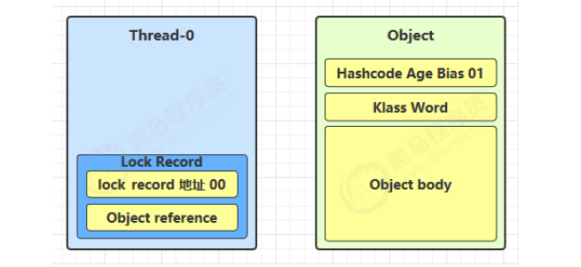
- 让锁记录中 Object reference 指向锁住的对象，并尝试用CAS交换锁记录的地址（lock record 地址 00）和Object的markword
- 如果 CAS 替换成功，对象头中存储了锁记录地址和状态 00（轻量级锁） ，表示由该线程给对象加锁
- 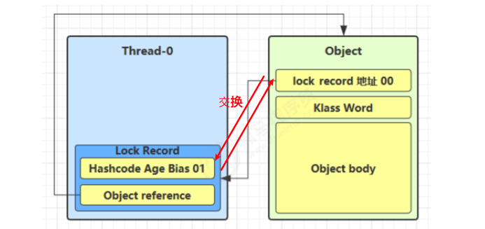
- 如果CAS交换失败，有两种情况：
  - 如果是其它线程已经持有了该 Object 的轻量级锁，这时表明有竞争，进入锁膨胀过程
  - 如果是线程自己执行了 synchronized 锁重入，就添加一条 Lock Record 作为重入的计数（上述代码的情况）
  - 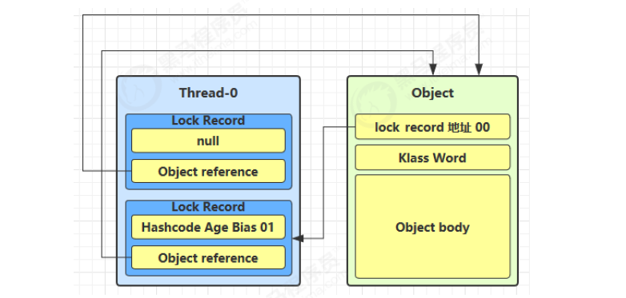
- 当退出 synchronized 代码块（解锁时）
  - 如果有取值为 null 的锁记录，表示有重入，这时重置锁记录，表示重入计数减 1
  - 如果锁记录的值不为 null，这时使用 CAS 将 Mark Word 的值恢复给对象头
    - 成功，则解锁成功
    - 失败，说明轻量级锁进行了锁膨胀或已经升级为重量级锁，进入重量级锁解锁流程

## 锁膨胀
### 概念
在尝试加轻量级锁的过程中，CAS 操作无法成功，可能是其它线程为此对象加上了轻量级锁（有竞争），这时需要进行锁膨胀，将轻量级锁变为重量级锁  

### 锁膨胀过程
- 当 Thread-1 进行轻量级加锁时，Thread-0 已经对该对象加了轻量级锁
- 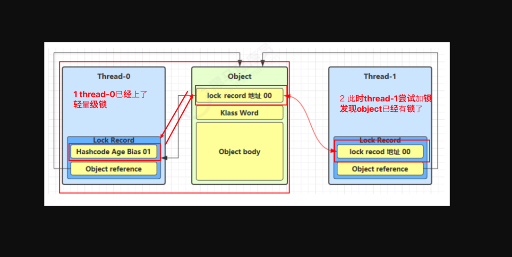
- Thread-1 加轻量级锁失败，进入锁膨胀流程：为 Object 对象申请 Monitor 锁，通过 Object 对象头获取到持锁线程，将 Monitor 的 Owner 置为 Thread-0，将 Object 的对象头指向重量级锁地址，然后自己进入 Monitor 的 EntryList BLOCKED
- 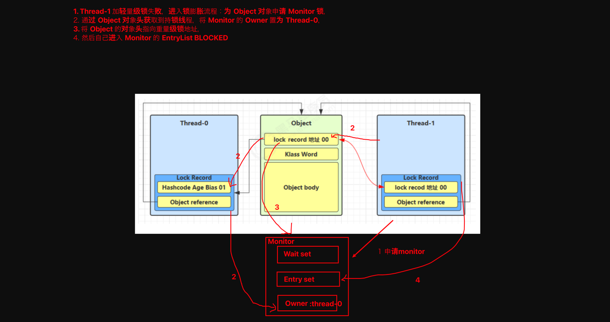
- 当 Thread-0 退出同步块解锁时，使用 CAS 将 Mark Word 的值恢复给对象头失败，这时进入重量级解锁流程，即按照 Monitor 地址找到 Monitor 对象，
- 把线程栈的锁记录中的对象头的值设置回 MarkWord，设置 Owner 为 null，唤醒 EntryList 中 BLOCKED 线程


## 自旋优化
### 自旋锁
重量级锁竞争的时候，可以采取自旋来优化，如果当前线程自旋成功（即吃锁线程退出了同步代码块），当前线程可以避免阻塞

- 自旋成功的例子
- 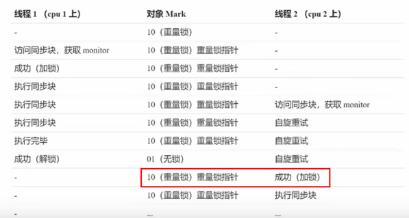
- 自旋失败的例子
- 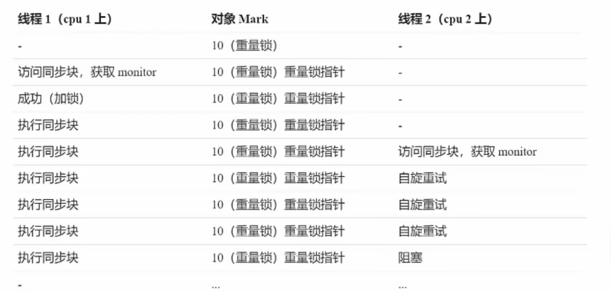

- java6之后，自旋锁是自适应的。加入刚刚自旋成功过，那么会认为自旋成功率会提高，就会多自旋几次；反之不自旋
- 自旋会占用cpu时间，单核cpu自旋是浪费时间，多核cpu才能发挥优势
- java7之后不能手动控制是否开启自旋

## 偏向锁
### 概念
轻量级锁在没有竞争时，每次冲入仍然需要执行CAS操作。  
java6中引入了偏向锁做进一步的优化：只有第一次使用CAS的时候，会把线程ID设置到对象头的markword上，之后锁重入的时候，发现这个线程ID是自己，就不会执行  
CAS操作，以后只要不发生竞争，这个对象就专属于该线程。  

```java
public class Demo{
    static final Object obj = new Object();
    
    public void demo1() {
        synchronized (obj) {
          // sync block 1
          demo2();
        }
    }

    public void demo2() {
        synchronized (obj) {
            // sync block 2
            demo3();
        }
    }

    public void demo3() {
        synchronized (obj) {
            // sync block 3
        }
    }
}
```
- 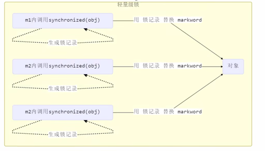
- 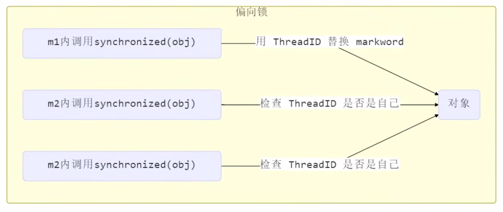

### 偏向状态  
对象头格式  
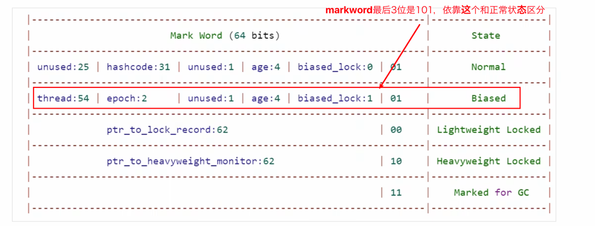

一个对象创建时候：
- 如果开启了偏向锁（默认开启），那么对象创建后，markword的值是0x05，即最后3位是101，这是thread，epoch，age都是0
- 偏向锁默认是延迟的，不会在线程启动时立即生效，如果要避免延迟，可以追加JVM参数 -XX:BiasedLockingStartupDelay=0来禁用延迟
- 如果没有开启偏向锁，那么对象的最后3位是001（normal），hashcode，age都是0，hashcode第一次被用到的时候才赋值
- -XX:-UseBiasedLocking 禁用偏向锁
- 优先级划分：有偏向锁优先偏向锁 -> 有线程使用锁对象，则撤销偏向锁，变为轻量级锁（错开的时间段使用这个锁对象） -> 有线程竞争锁对象，锁膨胀为重量级锁
- 调用可偏向对象的hashcode的方法，会撤销可偏小状态，转变为普通状态，因为hash code在可偏向状态下，不够存储。而轻量级锁的hashcode，age会存入线程栈桢的锁记录，重量级锁会存入monitor对象中
- 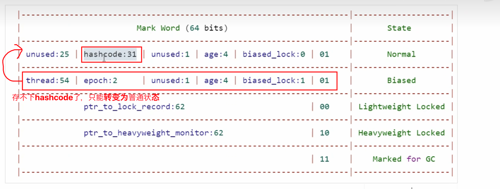


### 偏向撤销
- 使用锁对象的hashcode方法，原因如上：因为偏向锁的markword没更多空间存储hashcode，所以必须转变为普通状态
- 锁对象被其他线程使用，使用的时机必须错开，即当前线程已经退出同步代码块，锁对象目前是可偏向状态。然后又有新的线程来使用这个锁对象，就会由于偏向锁 -> 轻量级锁
- wait/notify机制，这种机制只有重量级锁有，所以一定会退出偏向状态

### 批量重偏向
对象被多个线程使用，但是使用的时机上是错开的，没有竞争。偏向T1线程的对象，有可能偏向T2线程，偏向就是对象中的markword存储的线程ID从T1变成T2  
当撤销偏向锁阈值到达20次后，jvm会觉得是不是自己偏向错了，会重新偏向。

```java
import java.util.ArrayList;

class Demo {
  public static void main(String[] args) {
      
    List<Object> list = new ArrayList<>();
    Thread t1 = new Thread(() -> {
      for (int i = 0; i < 30; i++) {
        Object o = new Object();
        list.add(o);

        // 此时30个对象依次进入同步代码块，那么会有30个对象偏向t1线程
        synchronized (o) {
          // todo 
        }
      }
    }, "t1").start();
    
    // 执行逻辑，等到t1线程执行完

    Thread t2 = new Thread(() -> {
      for (int i = 0; i < 30; i++) {
        Object o = list.get(i);
        // 此时偏向t1的对象会发生：偏向撤销 -> 升级到轻量级锁 -> 撤销偏向（Normal状态）
        // 这个过程重复20次以后，jvm开始批量重偏向，把剩下的10个对象直接偏向到 t2线程
        synchronized (o) {
          // todo 
        }
      }
    }, "t2").start();
  }
}
```

### 批量撤销
当撤销偏向锁阈值超过40次时，jvm会觉得偏向却是错了。整个类的所有对象都不应该偏向，新创建的类也不是偏向对象。这就是批量撤销

# Wait / Notify
## 原理  
### 图解
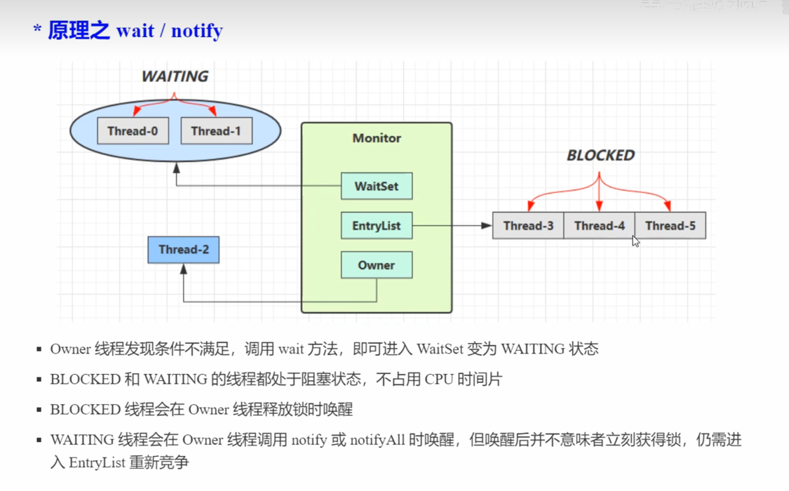

## API介绍
- obj.wait(): 让获取到obj锁的线程到WaitSet中等待，并且释放obj锁
- obj.notify(): 获取到obj锁的线程，找到monitor对象，在找到waitset，调里面一个线程进行唤醒
- obj.notifyAll(): 获取到obj锁的线程，找到monitor对象，在找到waitset，对里面全部线程进行唤醒
  - [wait and notify demo](./src/main/java/org/example/waitandnotify/WaitAndNotifyDemo.java)


## 正确使用姿势
### sleep(long n) / wait(long n)的区别
1. sleep是Thread的方法，wait是Object的方法
2. sleep不需要配合synchronized使用，wait必须要
3. sleep不会释放锁，但是wait会
4. 他们的状态都是TIMED_WAITING


## 同步模式之保护性暂停
### 概念
Guarded suspension，用一个线程等待另一个线程的执行结果
要点：
- 有一个结果需要从一个线程传递到另一个线程，让他们关联同一个Guarded suspension
- 如果有结果不断的从一个线程传递到另一个线程，那么使用消息队列（生产者/消费者）
- JDK中，join/future的实现就是采用此种模式
- 因为要等待另一方的结果，因为归类到同步模式
- 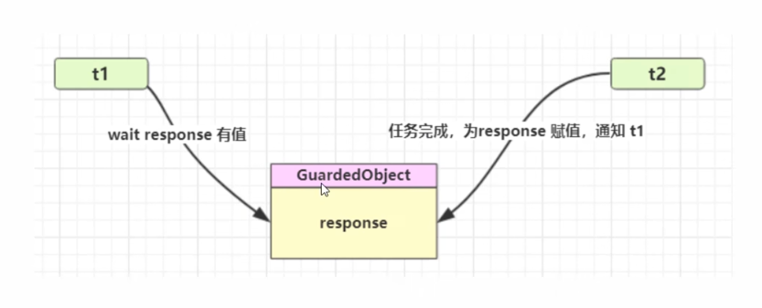

### 代码
[GuardedSuspensionDemo](./src/main/java/org/example/designpattern/GuardedSuspensionDemo.java)
```java
package org.example.designpattern;

import lombok.extern.slf4j.Slf4j;

@Slf4j
public class GuardedSuspensionDemo {
  public static void main(String[] args) {
    GuardedObject guarded = new GuardedObject();

    // 线程1 已进入逻辑，直接wait，等待结果
    new Thread(() -> {
      try {
        Object result = guarded.get();
        log.info("result: {}", result);
      } catch (InterruptedException e) {
        throw new RuntimeException(e);
      }

    }, "t1").start();

    // 线程2 进入逻辑生产一个字符串给线程1
    new Thread(() -> {
      guarded.set("wahahahahahhaha");
    }, "t2").start();


  }
}

/**
 * 线程1需要从线程2中获取结果
 */
@Slf4j
class GuardedObject {
  private Object guardedObject;

  // 线程1获取线程2的结果, 指定最大的等待时间
  // 这个方法就是Thread.join的原理。保护性暂停模式
  public Object get(long timeout) throws InterruptedException {
    synchronized (this) {

      long beginTime = System.currentTimeMillis();
      long passedTime = 0;

      while (guardedObject == null) {
        long waitTime = timeout - passedTime;
        if (waitTime <= 0) {
          break;
        }

        log.info("线程2，还没把结果传过来");
        this.wait(waitTime);
        passedTime = System.currentTimeMillis() - beginTime;
      }
    }

    return guardedObject;
  }

  // 线程1获取线程2的结果
  public Object get() throws InterruptedException {
    synchronized (this) {
      while (guardedObject == null) {
        log.info("线程2，还没把结果传过来");
        this.wait();
      }
    }

    return guardedObject;
  }

  // 线程2生产结果，放到guardedObject中
  public void set(Object object) {
    synchronized (this) {
      log.info("生产好了");
      this.guardedObject = object;
      this.notify();
    }
  }
}
```

## 异步模式之生产者消费者模型
### 要点
- 不需要生产结果和消费结果的线程一一对应
- 消费队列可以用来平衡生产和消费的线程资源
- 生产者仅负责生产数据，不需要关心数据如何处理，消费者专心负责处理数据
- 消息队列是有容量限制的，满时不会加入，空时不会消耗
- JDK中的各种阻塞队列，就是采用这种设计模式
  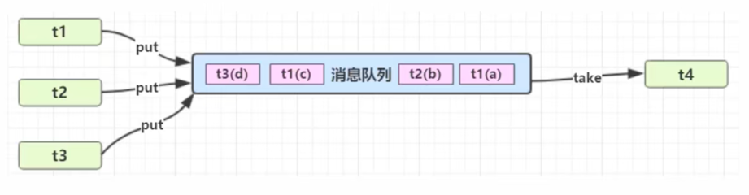

### 代码
[Producer and consumer](./src/main/java/org/example/designpattern/ProducerAndConsumer.java)
```java
package org.example.designpattern;

import lombok.extern.slf4j.Slf4j;

import java.util.LinkedList;

@Slf4j
public class ProducerAndConsumer {

    public static void main(String[] args) {
        MessageQueue messageQueue = new MessageQueue(2);

        // producer
        for (int i = 0; i < 3; i++) {
            int id = i;
            new Thread(() -> {
                try {
                    messageQueue.put(new Message(id, "value-" + id));
                } catch (InterruptedException e) {
                    throw new RuntimeException(e);
                }
            }, "Producer-" + i).start();
        }

        new Thread(() -> {
            try {
                messageQueue.get();
            } catch (InterruptedException e) {
                throw new RuntimeException(e);
            }
        }, "consumer").start();
    }
}

@Slf4j
class MessageQueue {
    private final LinkedList<Message> list;
    private final int capacity;

    public MessageQueue(int capacity) {
        this.capacity = capacity;
        this.list = new LinkedList<>();
    }

    public Message get() throws InterruptedException {
        synchronized (this.list) {
            while (list.isEmpty()) {
                log.info("empty list");
                list.wait();
            }

            Message message = list.removeFirst();
            list.notifyAll();
            log.info("consumer message: {}", message);
            return message;
        }
    }

    public void put(Message message) throws InterruptedException {
        synchronized (this.list) {
            while (this.capacity == list.size()) {
                log.info("queue max size, can not put");
                list.wait();
            }

            list.addLast(message);
            log.info("put the message: {}", message);
            list.notifyAll();
        }
    }
}

final class Message {
    private final int id;
    private final Object message;

    public Message(int id, Object message) {
        this.id = id;
        this.message = message;
    }

    public Object getMessage() {
        return message;
    }

    public int getId() {
        return id;
    }

    @Override
    public String toString() {
        return "Message{" +
                "id=" + id +
                ", message=" + message +
                '}';
    }
}
```

## LockSupport： Park & UnPark
### 概念和使用
和Object的wait和notify相比
- wait，notify，notifyAll必须配合Object的Monitor对象一起使用，而park/unPark不用
- park/unPark以线程为单位来进行阻塞和唤醒，notify不能精确的唤醒某一个线程
- park/unPark可以先进性unPark，后续代码即使执行park方法，线程也不会阻塞

```diff
// 在正在执行中线程中运行
+ LockSupport.park()

// 线程对象就是t1，t2的thread对象
+ LockSupport.unPark(线程对象)
```

### 原理
每个线程都有自己的一个parker对象，由三部分组成_counter, _cond, mutex
- 线程就像是一个旅人，parker是背包。cond是帐篷，_counter是干粮（0:没有， 1：有）
- 调用park方法，就是看看是否需要停下来休息
  - 如果没有干粮（_counter=0），那么需要进入帐篷休息
  - 如果有干粮（_counter=1 -> _counter=0）消耗一个干粮，可以继续前进
- 调用unpack方法,让干粮充足（使_counter=1）
  - 如果线程还在休息，唤醒线程继续前进
  - 如果线程本身还在运行状态，那下次调用part方法的时候只会消耗干粮（使_counter=0），并不会停止线程
    - 多次调用unpark方法只会补充一次干粮

### 例子 park方法
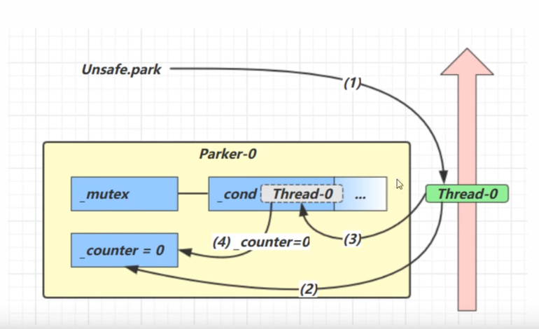
1. 当前线程调用Unsafe.park方法
2. 检查_counter，本情况为0，获得mutex互斥锁
3. 进入_cond条件变量阻塞
4. 设置_counter=0

### 例子 unpark方法
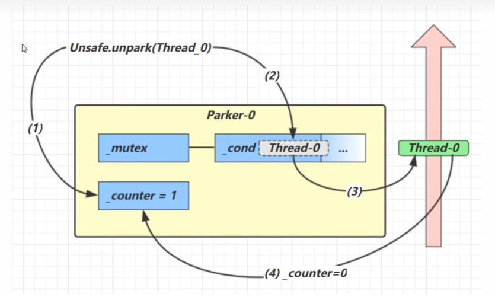
1. 调用unPark方法，设置_counter=1
2. 当前线程调用park方法，
3. 检查_counter，本情况为1，无需阻塞
4. 设置_counter为0


## 线程状态转换
### 转换图和其对应的方法
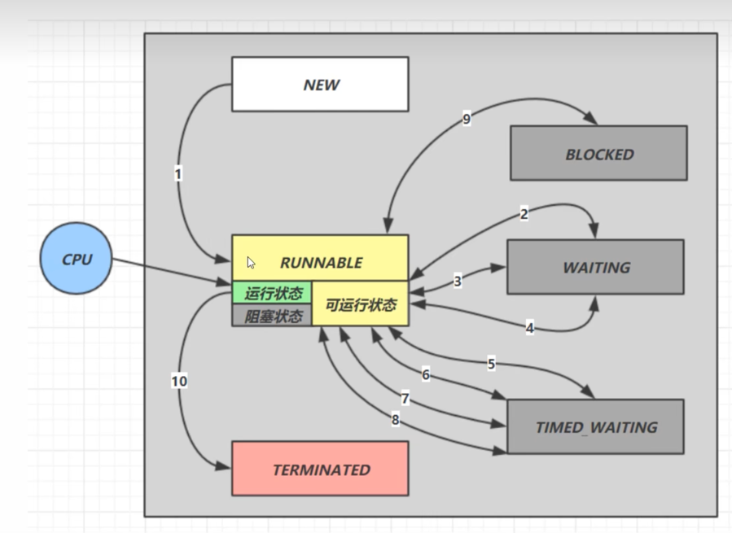
#### 情况1. NEW -> RUNNABLE  
> 当调用t.start()

#### 情况2. RUNNABLE <-> WAITING
t线程使用synchronized(obj)获取对象锁之后
- 调用obj.wait()方法时，t线程会从RUNNABLE -> WAITING
- 调用obj.notify(), obj.notifyAll(), t.interrupt()时候
  - 竞争锁成功， WAITING -> RUNNABLE
  - 竞争锁失败， WAITING -> BLOCKED

#### 情况3. RUNNABLE <-> WAITING
- **当前线程**调用t.join()方法，**当前线程**会从RUNNABLE -> WAITING
  - 注意是**当前线程**在**t线程对象**的监视器上等待
- **t线程**线程运行结束，或者调用了**当前线程**的interrupt方法，**当前线程**从WAITING -> RUNNABLE

#### 情况4. RUNNABLE <-> WAITING
- 当前线程调用了LockSupport.park()方法，会让当前线程从RUNNABLE -> WAITING
- 调用LockSupport.unpark(目标线程)或者调用了目标线程的inerrupt方法，会让目标线程WAITING -> RUNNABLE

#### 情况5. RUNNABLE <-> TIMED_WAITING
t线程使用synchronized(obj)获取对象锁之后
- 调用obj.wait(long n)方法时，t线程会从RUNNABLE -> TIMED_WAITING
- t线程等待时间超过了n毫秒，或者调用obj.notify(), obj.notifyAll(), t.interrupt()时候
  - 竞争锁成功， TIMED_WAITING -> RUNNABLE
  - 竞争锁失败， TIMED_WAITING -> BLOCKED

#### 情况6. RUNNABLE <-> TIMED_WAITING
- 当线程调用t.join(long n)方法的时候，当前程会从RUNNABLE -> TIMED_WAITING
  - 注意是当前线程在t对象的monitor上等待
- 当前线程等待时间超过n毫秒，或者t线程运行结束，或者调用了当前线程的interrupt方法，当前线程从TIMED_WAITING -> RUNNABLE

#### 情况7. RUNNABLE <-> TIMED_WAITING
- 调用Thread.sleep(long n)方法时，当前线程会从RUNNABLE -> TIMED_WAITING
- 当前线程等待时间超过n毫秒，当前线程从TIMED_WAITING -> RUNNABLE

#### 情况8. RUNNABLE <-> TIMED_WAITING
- 当线程调用LockSupport.parkNanos(long nanos)或者LockSupport.parkUnit(long miles),当前线程从RUNNABLE -> TIMED_WAITING
- 调用了LockSupport.unpark()或者interrupt方法，或者是等待超时的时候，TIMED_WAITING -> RUNNABLE

#### 情况9. RUNNABLE <-> BLOCKED
- t线程在 synchronized(obj)  竞争对象锁的时候失败了，RUNNABLE -> BLOCKED
- 其余线程执行完毕同步代码块，t线程抢到了锁，BLOCKED -> RUNNABLE

#### 情况9. RUNNABLE <-> TERMINATED
当前线程所有代码运行完毕

### 一个线程可以持有多把锁吗？
可以，但是容易发生死锁

## 线程活跃性
### 死锁
t1线程已经获得了锁A，并且将要去获取锁B  
t2线程已经获得了锁B，并且将要去获得锁A
[Dead Lock](./src/main/java/org/example/deadlock/DeadLockDemo.java)

```java
package org.example.deadlock;

public class DeadLockDemo {
    public static void main(String[] args) {
        Object a = new Object();
        Object b = new Object();

        new Thread(() -> {
            synchronized (a) {
                try {
                    Thread.sleep(100);

                    synchronized (b) {
                        System.out.println("b = " + b);
                    }
                } catch (InterruptedException e) {
                    throw new RuntimeException(e);
                }
            }
        }, "t1").start();

        new Thread(() -> {
            synchronized (b) {
                try {
                    Thread.sleep(50);

                    synchronized (a) {
                        System.out.println("b = " + b);
                    }
                } catch (InterruptedException e) {
                    throw new RuntimeException(e);
                }
            }
        }, "t2").start();
    }
}

```

### 定位死锁
#### 使用jps + jstack命令
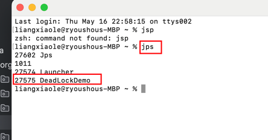
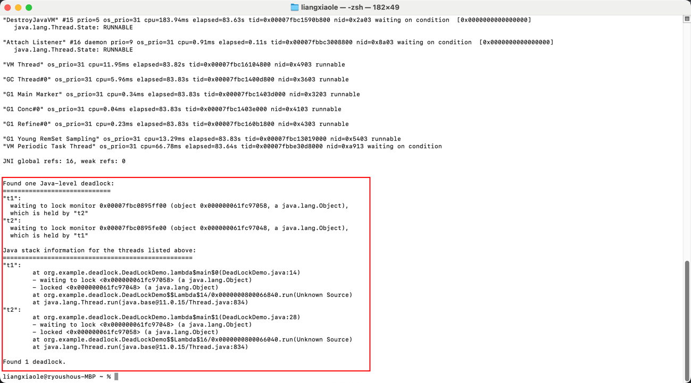

#### jconsole
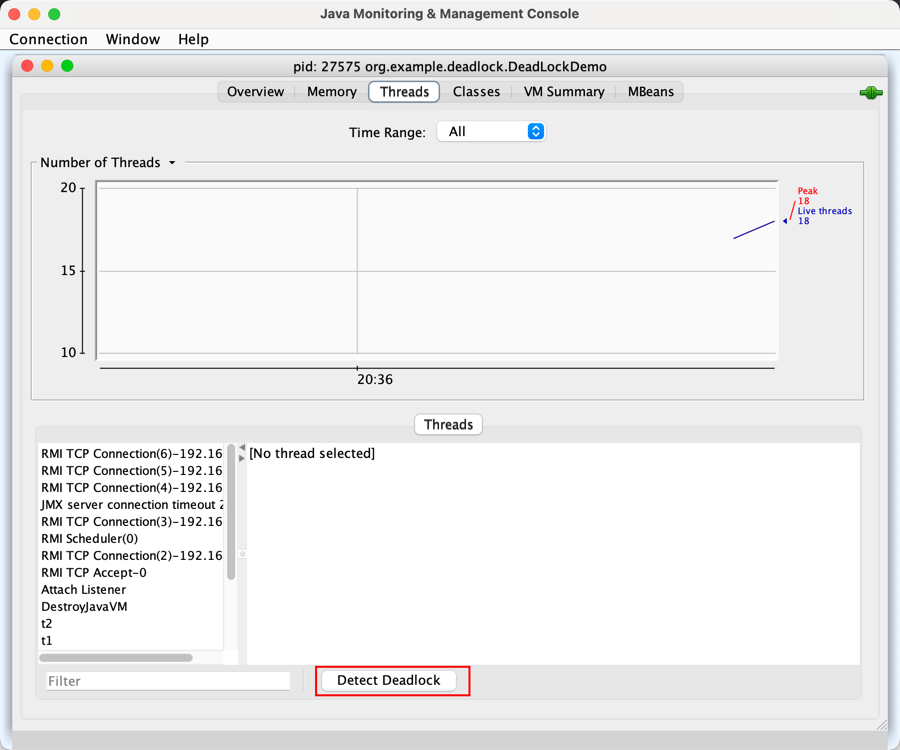

### 活锁
两个线程相互改变对方的结束条件,最后谁都无法结束
[Alive Lock](./src/main/java/org/example/deadlock/AliveLockDemo.java)

```java
package org.example.deadlock;

import lombok.extern.slf4j.Slf4j;

@Slf4j
public class AliveLockDemo {

    static int count = 10;

    public static void main(String[] args) {
        new Thread(() -> {
            while (count > 0) {
                try {
                    Thread.sleep(200);
                    count--;
                    log.info("count: {}", count);
                } catch (InterruptedException e) {
                    throw new RuntimeException(e);
                }
            }
        }, "t1").start();

        new Thread(() -> {
            while (count < 20) {
                try {
                    Thread.sleep(200);
                    count++;
                    log.info("count: {}", count);
                } catch (InterruptedException e) {
                    throw new RuntimeException(e);
                }
            }
        }, "t2").start();
    }
}

```

### 饥饿
一个线程由于优先级太低，始终得不到CPU的运行时间便，也不能结束执行
[interruptbly](./src/main/java/org/example/reentrantlock/ReentrantLockDemo.java)

## ReentrantLock
### 概念
相对于synchronized，它具备以下特点
- 可中断
- 可以设置超时时间
- 可以设置为公平锁
- 支持多个条件变量（多个wait set）
- 与synchronized一样，都支持重入
- 基本语法
```diff
// 获取锁
reentrantLock.lock();
try {
  // 临界区
} finally {
  // 释放锁
  reentrantLock.unlock();
}
```

### 可重入
可重入是指同一个线程如果首次获得了这把锁，那么因为他是这把锁的拥有者，因此有权利再次获得这把锁  
如果是不可重入锁，那么第二次获得锁时，自己也会被锁挡住

### 可打断
在等待锁的时候，可以被打断（注意是：在等待获得锁的时候被打断，不是获得锁之后被打断）
[interruptbly](./src/main/java/org/example/reentrantlock/ReentrantLockDemo.java)

使用
```diff
+ lock.lockInterruptibly();
```
```java
package org.example.reentrantlock;

import lombok.extern.slf4j.Slf4j;

import java.util.concurrent.locks.ReentrantLock;

@Slf4j
public class ReentrantLockDemo {
    private static ReentrantLock lock = new ReentrantLock();

    public static void main(String[] args) throws InterruptedException {
        Thread t1 = new Thread(() -> {

            try {
                // 如果没有竞争，那么此方法就会获取lock对象锁
                // 如果有竞争就进入阻塞队列，可以被其他线程用interrupt方法打断
                log.info("trying to get the lock");
                lock.lockInterruptibly();
            } catch (InterruptedException e) {
                e.printStackTrace();

                // 一旦被打断就会进入catch块
                log.info("can not get lock");
                return; // 因为没有获得锁，所以无法进入同步代码块执行逻辑，只能现行return
            }

            try {
                log.info("got the lock");
            } finally {
                lock.unlock();
            }
        }, "t1");

        // 主线程 先加锁
        lock.lock();

        // t1线程在启动
        t1.start();

        // 主线程打断t1线程
        Thread.sleep(1000);
        t1.interrupt();
        
    }
}

```

### 锁超时
避免线程无限制的尝试获取锁
[trylock](./src/main/java/org/example/reentrantlock/TryLockDemo.java)
```java
package org.example.reentrantlock;

import lombok.extern.slf4j.Slf4j;

import java.util.concurrent.locks.ReentrantLock;

@Slf4j
public class TryLockDemo {
    private static ReentrantLock lock = new ReentrantLock();

    public static void main(String[] args) throws InterruptedException {
        Thread t1 = new Thread(() -> {

            log.info("trying to get the lock");

            // lock.tryLock() 获取锁成功的话，返回true，都则返回false
            // lock.tryLock(long n) 可以指定等待时间
            if (!lock.tryLock()) {
                log.info("haven't got the lock");
                return;
            }

            try {
                log.info("got the lock");
            } finally {
                lock.unlock();
            }
        }, "t1");

        // 主线程 先加锁
        lock.lock();

        // t1线程在启动
        t1.start();
    }
}

```

### 公平锁
ReentrantLock默认是不公平的，通过构造方法来指定是否是公平, 一般没有设置必须，因为会降低并发  
```diff
    /**
     * Creates an instance of {@code ReentrantLock} with the
     * given fairness policy.
     *
     * @param fair {@code true} if this lock should use a fair ordering policy
     */
    public ReentrantLock(boolean fair) {
+       sync = fair ? new FairSync() : new NonfairSync();
    }
```

### 条件变量
类似于wait notify notifyAll  
ReentrantLock的条件变量比synchronized强大的地方在于，支持多个条件变量

使用流程
- await前需要获得锁
- await执行后，会释放锁，进入conditionObject 等待
- await的线程被唤醒（或打断，或超时），需要重新竞争lock
- 竞争锁成功后，从await后继续执行
```java
package org.example.reentrantlock;

import lombok.extern.slf4j.Slf4j;

import java.util.concurrent.locks.Condition;
import java.util.concurrent.locks.ReentrantLock;

@Slf4j
public class ConditionVariableDemo {
  private static ReentrantLock lock = new ReentrantLock();

  public static void main(String[] args) throws InterruptedException {

    // 创建一个新的条件变量
    Condition condition1 = lock.newCondition();
    Condition condition2 = lock.newCondition();

    lock.lock();
    // 进入waitSet，让线程进入休息室(wait set)等待
    condition1.wait();  // 一般有一个线程会执行这个代码，另一个线程回去执行condition1.signal();来完成线程间的合作


    // 让线程从休息室(wait set)里面出来,重新竞争锁
    condition1.signal();
    condition1.signalAll();
  }
}
```

# JMM java内存模型
## 本章内容
JMM即 java memory model，它定义了主存，工作内存抽象概念，底层对应着CPU寄存器，缓存，硬件内存，CPU指令优化  
JMM体现在以下几个方面
- 原子性：保证指令不会受到线程上下文切换的影响
- 可见性：保证指令不会受到cpu缓存的影响
- 有序性：保证指令不会首指令并行优化的影响

## 可见性
### 退不出的循环
先看一个现象，main线程对run变量的修改对于t线程不可见，导致了t线程无法停止
```java
package org.example.jmm;

public class EndlessLoop {
    
    static boolean run = true;
    public static void main(String[] args) throws InterruptedException {
        new Thread(() -> {
            while (run) {
                // 
            }
        }).start();
        
        Thread.sleep(1);
        
        run = false;
    }
}
```

原因：
1，初始状态，t线程刚开始从主内存读取了run的值到工作内存
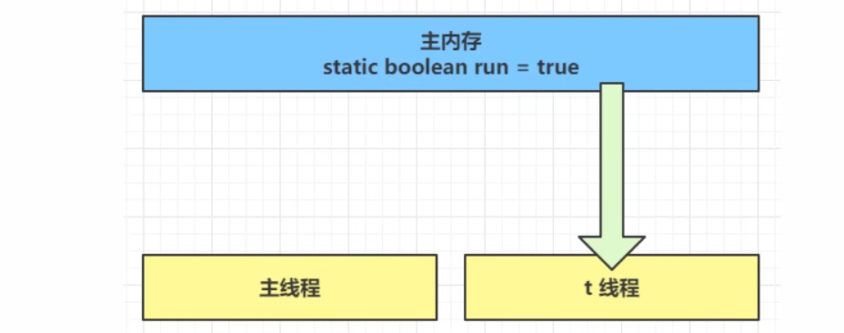

2，因为t线程要频繁从主内存中读取run的值，JIT编译器会将run的值缓存至自己的工作内存中的告诉缓存中，减少对于主内存中run的访问，提高效率
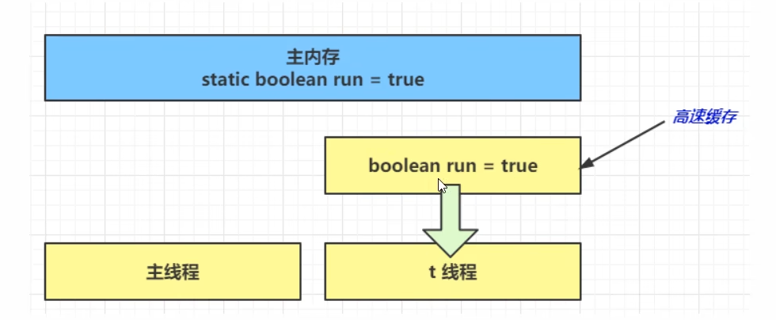

3，1秒之后，main线程修改了run的值，并同步至主存，而t是从自己的工作内存中的告诉缓存中读取这个变量的值，结果永远是旧值
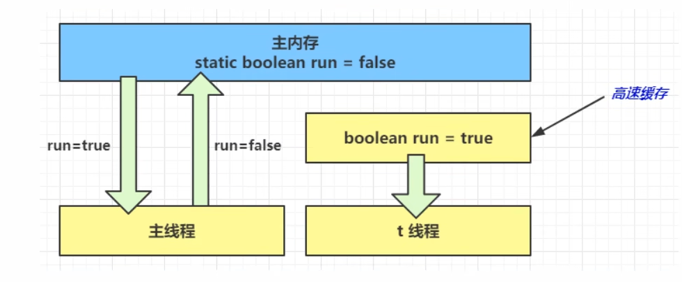

解决办法：  
volatile关键字，禁止从工作内存中获取共享变量的值.  用来修饰成员变量和静态变量，他可以避免线程从自己的工作缓存中超找变量的值，必须到主存中获取它的值。线程操作volatile变量都是直接操作主存  
（synchronized关键字也可以）
```diff
+ volatile static boolean run = true;
```

### 可见性 vs 原子性
前面的例子体现了可见性，它保证的是在多个线程之间，一个线程对volatile变量的修改对另一个线程可见，不能保证原子性，仅用在一个写线程，多个读线程的情况。  

如果两个线程一个i++一个i--，只能保证看到最新的值，不能解决指令交错

## 有序性
### 概念
JVM在不影响正确性的前提下，可以调整语句执行的顺序，这种特性称之为指令重排。多线程下指令重排会影响正确性。

### 指令重排序优化
现代处理器会设计为一个时钟周期完成一条执行时间很长的CPU指令，为什么这么做呢？可以想到指令还可以划分成一个个更小的阶段，例如，每条指令都可以氛围：  
取指令 - 指令译码 - 执行指令 - 内存访问 - 数据会写。
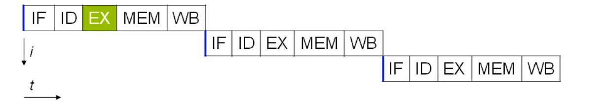

在不改变程序结果的前提下，这些指令的各个阶段可以通过重排序和组合来实现指令级并行
> 提示： 分阶段，分工是提升效率关键  

指令重拍的前提是，重拍指令不能影响结果
```diff
+ // 可以重排的例子
  int a = 10;
  int b = 20;
  System.out.print(a + b);
  
- // 不可以重排的例子
  int a = 10;
  int b = a - 5;
```

现代CPU支持多级指令流水线，例如支持同时执行：取指令 - 指令译码 - 执行指令 - 内存访问 - 数据会写的处理器，就可以成为5极指令流水线。  
这是CPU可以在一个时钟周期内，同时运行5条指令的不同阶段（相当于1条执行时间最长的复杂指令），本质上，流水线技术并不能缩短弹跳指令的执行时间，但它变相地提高了指令的吞吐率  
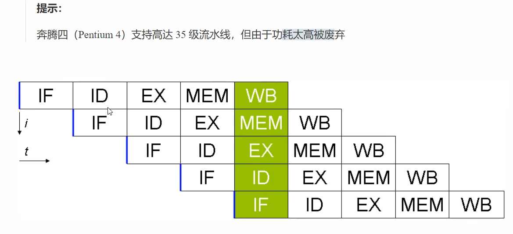

### 禁止指令重排
volatile关键字，某个变量加了这个关键字，可以防止这个变量所在地方之前的代码被重新排列

## Volatile原理
volatile的底层实现原理是内存屏障，Memory Barrier（Memory Fence）
- 对volatile变量的写指令后（即给volatile变量赋值），会加入写屏障
- 对volatile变量的读指令前（即用到了volatile变量），会加入读屏障

### 保证可见性
- 写屏障（sfence）保证在该屏障之前的，对共享变量的变动，都同步到主存当中
```diff
public void actor2(I_Result r) {
+ num = 2;
+ ready = true; // ready是volatile赋值，中加入写屏障，写屏障生效部分是，屏障之前（绿色部分）
  // 写屏障
}
```

- 读屏障（lfence）保证在该屏障之后，对共享变量的读取，加载的是主内存中最新数据
```diff
public void actor1(I_Result r) {
  // 读屏障
  // ready是volatile读取值，加入读屏障，读屏障生效部分是，屏障之后（绿色部分）
+ if (ready) {
+   r.r1 = num + num;
+ } else {
+   r.r1 = 1;
+ }
} 
```
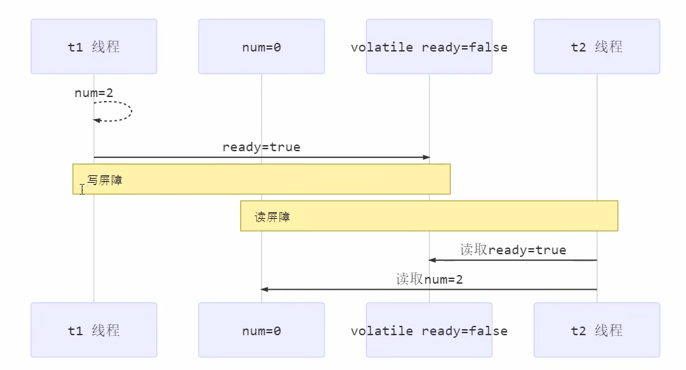

### 保证有序性
- 写屏障会确保指令重排时，不会将屏障之前的代码排在屏障之后
- 读屏障会确保指令重排时，不会将屏障之后的代码排在屏障之前  
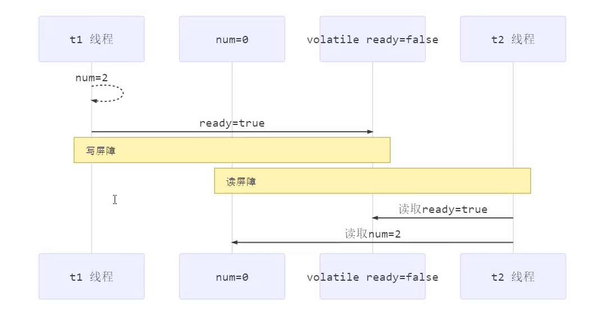

PS： 不能解决指令交错：
- 写屏障仅仅是保证之后的读能都读到最新的结果，但不能保证读跑到写屏障前面去
- 而有序性的保证也只是保证了本线程内相关代码不会重排
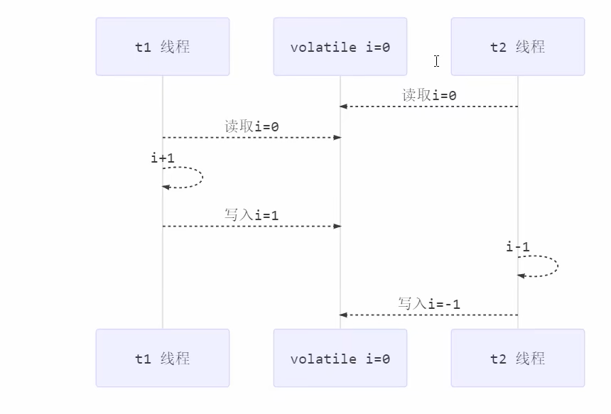

# 共享模型之无锁（乐观锁）
## CAS与volatile
AtomicInteger，内部并没有用锁来保护共享变量的线程安全。那么无锁怎么实现线程安全呢？
```diff
public void withdraw(Integer amount) {
  while (true) {
    int prev = balance.get(); // 调用AtomicInteger的get方法获取最新的值
    int next = prev - amount;
+   // 比较并且设置，会拿着prev值和balance里面最新的值进行比较，如果不同返回false，那么while会继续判断。直到相同，说明可以更新了
+   if (balance.compareAndSet(prev, next)) {
      break;
    }
  }
  
  // 上述方法也可以简写为
+ balance.getAndAdd(-1 * amount) // 获取并添加，添加负数代表减少余额  
}
```

其中的关键是compareAndSet，它的简称就是CAS（也有Compare and swap的说法），它必须是院子操作。
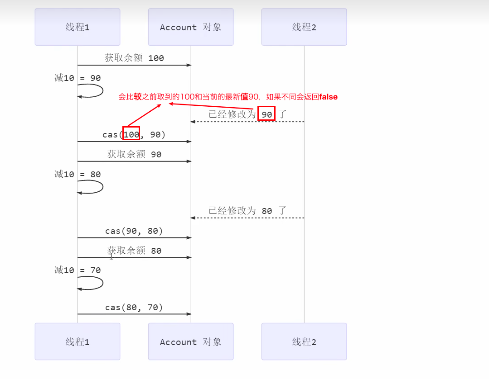

> PS:  
> 其实cas的底层是lock cmpxchg指令（x86）架构，在单核CPU和多核CPU下都能够保证【比较-交换】的原子性  
> 在多核状态下，某个核执行到带lock的指令时，CPU会让总线锁住，当这个核把次指令执行完毕，再开启总线，这个过程中不会被线程的调度机制打断，保证了多个线程对内存操作的准确性，是原子的

## volatile
获取共享变量时，为了保证该变量的可见性，需要使用volatile修饰。  
它可以用来修饰成员变量核静态成员变量，他可以避免线程从自己的工作缓存中查找变量的值，必须存到主存中获取他的值，线程操作volatile变量都是直接操作主存。  
即一个线程对volatile变量的修改，对另一个线程可见。 
> 注意：volatile仅仅保证了共享变量的可见性，让其他线程能够看到最新值，但不能解决指令交错问题（不能保证原子性）  

CAS必须借助volatile才能读取到共享变量的最新值来实现「比较并交换」的结果

## 为什么无锁效率高
- 无锁情况下，即使充实失败，线程始终在告诉运行，没有停歇，而synchronized会让线程在没有获得锁的时候，发生上下文切换，进入阻塞。  
- 上下文切换好比告诉跑到上的赛车，告诉运行时，速度很快，一旦发生上下文切换，就好比赛车要减速，熄火，等被唤醒又得重新大火，启动，加速，恢复到高速运行，代价大  
- 但无锁情况下，因为线程要保持运行，需要额外的CPU支持，CPU在这里就好比高速跑道，没有额外的跑道，线程想高速运行也无从谈起，虽然不会进入阻塞，但是由于没有分到时间便，仍然会进入可运行状态，还是会导致上下文切换

## CAS特点
结合cas和volatile可以实现无锁并发，适用于线程数少，多核CPU的情况
- CAS是基于乐观锁的思想，最乐观的估计，不怕别的线程来修改共享变量，就算改了也没关系，会进行重试
- synchronized是基于被关锁的思想：最悲观的估计，得防着其他线程来修改共享变量，我上了锁你们都别想该，我改完了解开锁，你们才有机会
- CAS体现的是无锁并发，无阻塞并发
  - 因为没有synchronized，所以线程不会先祖阻塞，这是效率提升的因素之一
  - 但因为竞争节烈，可以想到重试必然频繁发生，反而效率会受影响

### 原子整数
JUC并发包提供了：
- AtomicBoolean
- AtomicInteger
- AtomicLong

这些类都满足cas的原则，所以都是线程安全的  
方法都很简单，可以自己看类里面的方法。  

一些复杂方法，自定义运算规则
```diff
  AtomicInteger i = new AtomicInteger(0);

+ // 传入的是一个运算方法，这个方法用来计算i的值，参数是一个functional的接口
+ i.updateAndGet(value -> value * 10)
```

### 模拟updateAndGet
```diff
while (true) {
  int pre = i.get();
  int next = prev * 10;
  if (i.compareAndSet(prev, next)) {
    break;
  }
}
```

### 原子引用
原子引用类型：
- AtomicReference
- AtomicMarkableReference
- AtomicStampledReference

```java
import java.math.BigDecimal;
import java.util.concurrent.atomic.AtomicReference;

class DecimalAccountCas implements DecimalAccount {
  private AtomicReference<BigDecimal> balance;

  public DecimalAccountCas(BigDecimal balance) {
    this.balance = new AtomicReference<>(balance);
  }

  public BigDevimal getBalance() {
    return balance.get();
  }

  public void withdraw(BigDecimal amount) {
    while (true) {
      BigDecimal pre = balance.get();
      BigDecimal next = pre.subtract(amount);
        
      // compareAndSet会比较传入的pre，和当前balance的值是否相同，只有相同的时候才会return true。这是cas的思想
      // PS：使用cas，最好开启线程数量要小于等于CPU数量
      if (balance.compareAndSet(pre, next)) {
        break;
      }
    }
  }
}
```

### ABA 问题
按照上述的CAS操作，其实是有可能产生隐患的。主线程能判断出共享变量的值与最初值A是否相同，不能感知到从从A改回B又改回A的情况，如果希望主线程能判断：  
主要其他线程修改过共享变量，那么就算自己的cas失败，这时，仅仅比较值是不够的，需要再加一个版本号
看下面例子：
```java
package org.example.cas;

import lombok.extern.slf4j.Slf4j;

import java.util.concurrent.atomic.AtomicReference;

@Slf4j
public class AbaProblem {

    static AtomicReference<String> ref = new AtomicReference<>("A");

    public static void main(String[] args) throws InterruptedException {

        // 主线程获得期望值
        String prev = ref.get();

        // 其他的线程会修改ref的值，但是最终会修改成和主线程获得的期望值一样
        modifiedRef();
        Thread.sleep(200);

        // 主线程修改的话，会成功，因为期望是确实是一样的，但其实在主线程修改前，发生了两次修改，这个被主线程忽视了
        boolean result = ref.compareAndSet(prev, "C");
        System.out.println("result = " + result);
    }

    private static void modifiedRef() throws InterruptedException {
        new Thread(() -> {
            log.info("change: A -> B");
            ref.compareAndSet(ref.get(), "B");
        }, "t1").start();

        Thread.sleep(200);
        new Thread(() -> {
            log.info("change: B -> A");
            ref.compareAndSet(ref.get(), "A");
        }, "t2").start();

    }
}
```

怎么解决
```java
package org.example.cas;

import lombok.extern.slf4j.Slf4j;
import lombok.val;

import java.util.concurrent.atomic.AtomicReference;
import java.util.concurrent.atomic.AtomicStampedReference;

@Slf4j
public class AbaProblemResolved {

    static AtomicStampedReference<String> ref = new AtomicStampedReference<>("A", 0);

    public static void main(String[] args) throws InterruptedException {

        // 主线程获得期望值
        String prev = ref.getReference();
        int stamp = ref.getStamp();
        log.info("prev: {} version: {}", prev, stamp);

        // 其他的线程会修改ref的值，但是最终会修改成和主线程获得的期望值一样
        modifiedRef();
        Thread.sleep(200);

        // 主线程修改的话，会失败，因为版本号对比已经失败了
        boolean result = ref.compareAndSet(prev, "C", stamp, stamp + 1);
        System.out.println("result = " + result);
    }

    private static void modifiedRef() throws InterruptedException {
        new Thread(() -> {
            int stamp = ref.getStamp();
            log.info("change: A -> B");
            log.info("prev: {} version: {}", ref.getReference(), stamp);
            ref.compareAndSet(ref.getReference(), "B", stamp, stamp + 1);
        }, "t1").start();

        Thread.sleep(200);
        new Thread(() -> {
            int stamp = ref.getStamp();
            log.info("change: B -> A");
            log.info("prev: {} version: {}", ref.getReference(), stamp);
            ref.compareAndSet(ref.getReference(), "A", stamp, stamp + 1);
        }, "t2").start();

    }
}

```

### AtomicMarkableRefernce
AtomicStampedReference可以给原子引用加上版本号，追踪原子殷红的整个变化过程，如：A->B->A->C，通过AtomicStampedReference，可以知道，引用变量途中被变更了几次。  
但是有时候，并不关心引用变量变更了几次，只是单纯的关心是否变更过，所以就有了AtomicMarkableRefernce。 用法和通过AtomicStampedReference一样。
可以认为是ABA问题将错就错。

### 原子数组
当修改的对象不是某个值，而是某个引用中的属性的值，比如数组中某个元素，那么就需要用到数组相关的原子类
- AtomicIntegerArray
- AtomicLongArray
- AtomicReferenceArray

### 字段更新器
保护的是对象里面的属性（成员变量），当多个线程访问同一个对象的某个属性时，能保护这个属性，实现线程安全  
- AtomicReferenceFieldUpdater // 字段
- AtomicIntegerFieldUpdater
- AtomicLongFieldUpdater

利用字段更新器，可以针对对象的某个字段进行原子操作，只能配合volatile修饰的字段使用，否则会出现异常

```java
package org.example.cas;

import lombok.extern.slf4j.Slf4j;

import java.util.concurrent.atomic.AtomicReferenceFieldUpdater;

@Slf4j
public class UpdaterDemo {
  public static void main(String[] args) {
    Student student = new Student();

    // 3个参数分别代表：要修改的类，要修改的字段类型，要修改的字段名字
    AtomicReferenceFieldUpdater<Student, String> updater =
            AtomicReferenceFieldUpdater.newUpdater(Student.class, String.class, "name");

    // 第二个参数是当前对象的字段的值
    updater.compareAndSet(student, null, "Lisi");
    System.out.println("student = " + student);
  }
}

class Student {
  volatile String name;

  @Override
  public String toString() {
    return "Student{" +
            "name='" + name + '\'' +
            '}';
  }
}
```

### 原子累加器
- LongAdder (方法很简单，看源码就行)  

性能高的原因：有竞争时，设置多个累加单元，Thread-0累加Cell[0]，而Thread-1而家Cell[1]最后将结果汇总，这样他们在累加时操作不同的Cell变量，因此减少了CAS重试失败，从而提高了性能

## 共享模型值不可变
### 享元模式-自定义数据库连接吃

```java
package org.example.custompool;

import lombok.extern.slf4j.Slf4j;

import java.sql.*;
import java.util.Map;
import java.util.Properties;
import java.util.Random;
import java.util.concurrent.Executor;
import java.util.concurrent.atomic.AtomicIntegerArray;

@Slf4j
public class CustomPoolDemo {

    public static void main(String[] args) {
        Pool pool = new Pool(2);
        for (int i = 0; i < 5; i++) {
            new Thread(() -> {
                Connection conn = pool.borrow();
                try {
                    Thread.sleep(new Random().nextInt(1000));
                } catch (InterruptedException e) {
                    throw new RuntimeException(e);
                }
                pool.free(conn);
            }).start();
        }
    }
}

@Slf4j
class Pool {
    // 连接吃大小
    private final int poolSize;

    // 连接对象数组
    private Connection[] connections;

    // 连接状态， 0表示空闲，1表示繁忙
    private AtomicIntegerArray states;

    // 初始化属性
    public Pool(int poolSize) {
        this.poolSize = poolSize;
        this.connections = new Connection[poolSize];
        this.states = new AtomicIntegerArray(new int[poolSize]); // 使用原子累保护这个数组，
        for (int i = 0; i < poolSize; i++) {
            connections[i] = new MockConnection("连接" + (i + 1));
        }
    }

    // 获得连接
    public Connection borrow() {
        while (true) {
            for (int i = 0; i < poolSize; i++) {
                //  获取空闲连接
                if (states.get(i) == 0) {
                    // 原子操作，避免线程问题i
                    if (states.compareAndSet(i, 0, 1)) {
                        log.info("borrow {}", connections[i]);
                        // 原子操作成功之后才能返回连接
                        return connections[i];
                    }
                }
            }

            // 如果没有空闲连接， 当前线程等待，等待其他线程释放完后在继续获取
            synchronized (this) {
                try {
                    log.info("wait...");
                    this.wait();
                } catch (InterruptedException e) {
                    e.printStackTrace();
                    throw new RuntimeException(e);
                }
            }
        }
    }


    // 回收连接
    public void free(Connection conn) {
        for (int i = 0; i < poolSize; i++) {
            if (connections[i] == conn) {
                states.set(i, 0);
                // 唤醒正在等待的线程
                synchronized (this) {
                    log.info("free {}", conn);
                    this.notifyAll();
                }
                break;
            }
        }
    }
}

class MockConnection implements Connection {
    private String name;

    public MockConnection(String name) {
        this.name = name;
    }

    @Override
    public String toString() {
        return "MockConnection{" +
                "name='" + name + '\'' +
                '}';
    }

    // a lot of override methods
}
```

## 线程池
### 自定义线程池
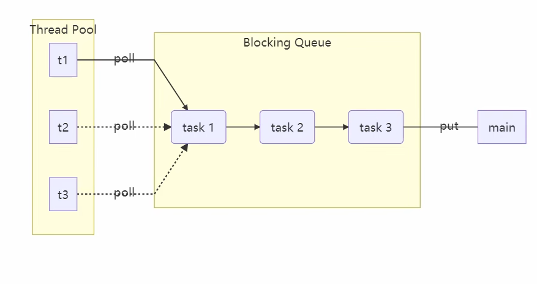

