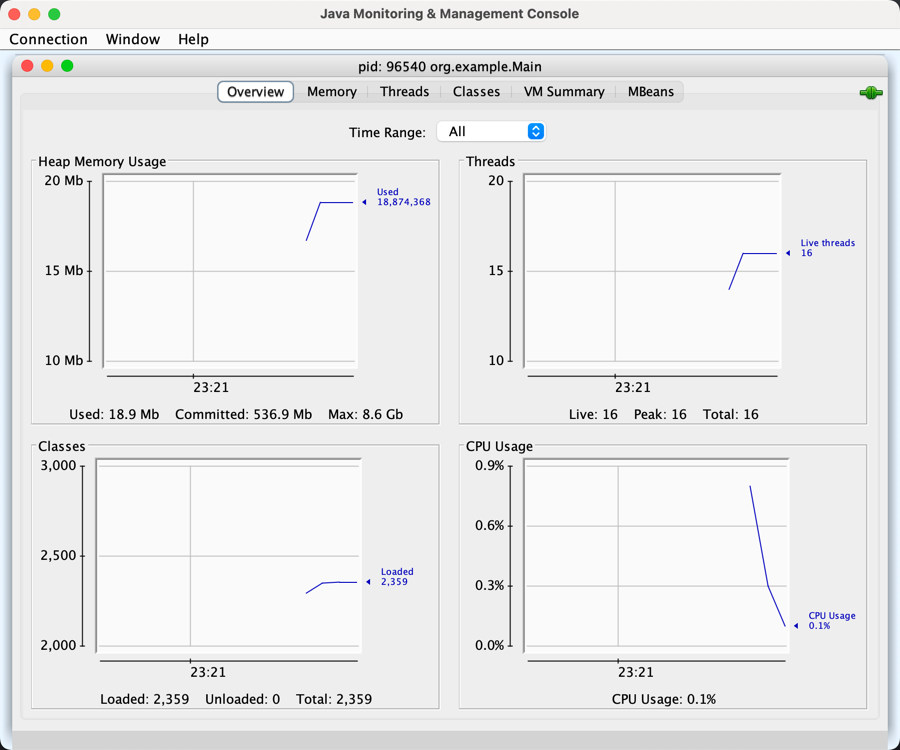

# 并发&并行
## 概念
并发（concurrent）： 单核CPU在不同线程之间跳转并且执行线程的指令，这种就是并发  
并行（parallel）： 双核甚至多核CPU，同时执行不同线程的指令，这叫做并行

## 注意
多线程执行只有在多核CPU下才能提高效率，在单核CPU下面还是串型执行

# 进程/线程相关
## 创建线程
### 方法1  
使用Thread类进行创建，new Thread时会创建其子类，子类的run方法执行线程逻辑。
无返回值，无异常抛出  
[方法 1](./src/main/java/org/example/createthread/CreateThread1.java)  

### 方法2   
使用Thread创建线程，使用runnable接口创建任务，runnable接口new的时候会创建实现类，实现run方法
把task和thread对象组合起来进行线程逻辑执行  
[方法 2](./src/main/java/org/example/createthread/CreateThread2.java)

### 方法3  
使用Thread创建线程，使用FutureTask + Callable接口创建又返回值和异常抛出的任务，
把线程和任务组合起来执行线程逻辑。为了获取task的返回接口，主线程会等待，知道task线程执行完并且返回  
[方法 3](./src/main/java/org/example/createthread/CreateThread3.java)

## 查看进程/线程
### 查看所有进程
```shell
# command
ps -ef
ps -ef | grep 关键字

# output：
  501 96282     1   0 10:58PM ??         0:00.33 /System/Applications/Utilities/Terminal.app/Contents/MacOS/Terminal
  501 94836  1011   0 Wed10PM ttys000    0:00.06 /bin/zsh --login -i
    0 96283 96282   0 10:58PM ttys002    0:00.01 login -pf liangxiaole
  501 96284 96283   0 10:58PM ttys002    0:00.02 -zsh
    0 96295 96284   0 10:58PM ttys002    0:00.00 ps -fe
```

### 使用jvm的命令查看进程 & 杀死进程
```shell
# command, 只查看java进程
jps

# output，前面的数字就是pid
96355 Jps
1011 
96069 Launcher

# 杀死进程，pid就是上面查出来的那穿数字
kill pid
kill 96355
```

### 动态显示进程/线程信息
```shell
# command 动态显示所有进程信息
top 

# output, 会动态刷新
PID    COMMAND      %CPU TIME     #TH    #WQ  #PORT MEM    PURG  CMPRS PGRP  PPID  STATE    BOOSTS           %CPU_ME %CPU_OTHRS UID  FAULTS    COW    MSGSENT     MSGRECV     SYSBSD      SYSMACH
93942  Google Chrom 37.3 55:09.52 23/1   1    338+  2353M+ 0B    41M   1003  1003  running  *0[613]          0.00000 0.00000    501  2741015+  1067   12036692+   4775231+    44087148+   26315074+
175    WindowServer 26.8 28:15:10 27     5    3480- 813M-  43M+  98M   175   1     stuck    *0[1]            1.42297 0.58395    88   89131383+ 581001 770610822+  684693773+  1243187730+ 2147483647
14760  Microsoft Ed 22.7 78:00.09 23/1   1    215   89M-   0B    11M   1025  1025  running  *0[8910]         0.00000 0.00000    501  296099    972    41639236+   15510314+   46888263+   87341388+
0      kernel_task  15.0 19:22:15 611/10 0    0     54M    0B    0B    0     0     running   0[0]            0.00000 0.00000    0    107501    0      1354146861+ 1001571010+ 0           0
1205   Google Chrom 11.2 18:05:26 25     5    313   279M+  37M   16M   1003  1003  sleeping *1[2]            0.12355 0.00000    501  49519620+ 5105   692334459+  325883364+  575235773+  1637356445+
96282  Terminal     10.3 00:04.25 8      3    300-  129M+  24M-  0B    96282 1     sleeping *0[96]           0.08909 0.79563    501  18586+    289    48181+      10888+      41715+      108169+
96375  top          7.3  00:00.80 1/1    0    27    10M+   0B    0B    96375 96284 running  *0[1]            0.00000 0.00000    0    5733+     87     940594+     470291+     25560+      507648+
1015   WeChat       4.9  02:23:22 51     15   1686  570M   0B    127M  1015  1     sleeping *0[75979]        0.15107 0.62858    501  21352342+ 1184   695352583+  338265341+  70810257+   1064551288+
1011   idea         4.2  07:29:22 177    5    942   3588M  75M   396M  1011  1     sleeping *0[28303]        0.00000 0.00000    501  6827260+  7135   35671510+   6132786     1433735235+ 218924487+
1

# 查看某个进程里面的线程, -H 查看线程 -p查看某个进程的线程
top -H -p pid
top -H -p 96388
```

### 某个时刻jvm的进程信息
```shell
jstack pid
```

### jconsole 图形化进程/线程查看工具
直接数据jconsole命令即可打开，也可以远程连接查看jvm信息
  
 

## 栈和栈桢
JVM由堆，栈，方法区组成。其中栈内存给线程使用，每个线程启动的时候，虚拟机就会为其分配一块栈内存  
- 每个栈由多个栈桢（frame）组成，对应每次调用方法时候所栈用的内存
- 每个线程只能有一个活动栈桢，对应当前正在执行的方法
 

## 线程方法

### 线程方法总结

Thread 类 API：  

| 方法                                          | 说明                                                               |
|---------------------------------------------|------------------------------------------------------------------|
| public void start()                         | 启动一个新线程，Java虚拟机调用此线程的 run 方法                                     |
| public void run()                           | 线程启动后调用该方法                                                       |
| public void setName(String name)            | 给当前线程取名字                                                         |
| public void getName()                       | 获取当前线程的名字<br />线程存在默认名称：子线程是 Thread-索引，主线程是 main                 |
| public static Thread currentThread()        | 获取当前线程对象，代码在哪个线程中执行                                              |
| public static void sleep(long time)         | 让当前线程休眠多少毫秒再继续执行<br />**Thread.sleep(0)** : 让操作系统立刻重新进行一次 CPU 竞争 |
| public static native void yield()           | 提示线程调度器让出当前线程对 CPU 的使用                                           |
| public final int getPriority()              | 返回此线程的优先级                                                        |
| public final void setPriority(int priority) | 更改此线程的优先级，常用 1 5 10                                              |
| public void interrupt()                     | 中断这个线程，异常处理机制                                                    |
| public static boolean interrupted()         | 判断当前线程是否被打断，清除打断标记                                               |
| public boolean isInterrupted()              | 判断当前线程是否被打断，不清除打断标记                                              |
| public final void join()                    | 等待这个线程结束，比如主线程想要拿到t1线程的结果，主线程调用这个方法后会等待t1线程执行完                   |
| public final void join(long millis)         | 等待这个线程死亡 millis 毫秒，0 意味着永远等待                                     |
| public final native boolean isAlive()       | 线程是否存活（还没有运行完毕）                                                  |
| public final void setDaemon(boolean on)     | 将此线程标记为守护线程或用户线程                                                 |

### 方法详解  
#### Start & Run 方法
- run：称为线程体，包含了要执行的这个线程的内容，方法运行结束，此线程随即终止。直接调用 run 是在主线程中执行了 run，没有启动新的线程，需要顺序执行  
- start：使用 start 是启动新的线程，此线程处于就绪（可运行）状态，通过新的线程间接执行 run 中的代码

[Start And Run](./src/main/java/org/example/threadmethod/StartAndRun.java)  

### Sleep & Yield
- sleep：
  - 调用 sleep 会让当前线程从 Running 进入 Timed Waiting 状态（阻塞）
  - sleep() 方法的过程中，线程不会释放对象锁
  - 其它线程可以使用 interrupt 方法打断正在睡眠的线程，这时 sleep 方法会抛出 InterruptedException
  - 睡眠结束后的线程未必会立刻得到执行，需要抢占 CPU
  - 建议用 TimeUnit 的 sleep 代替 Thread 的 sleep 来获得更好的可读性
- yield(Thread.yield())：
  - 调用 yield 会让当前线程从Running进入Runnable状态，然后调度器执行其他线程
  - 具体的实现依赖于操作系统的任务调度器
  - 会放弃 CPU 资源，锁资源不会释放
- [Start And Run Code](./src/main/java/org/example/threadmethod/SleepAndYield.java)

### 线程优先级
- 线程优先级会提示调度器，优先调度该线程。但这仅仅是一个提示，调度器可以忽略
- 如果cpu比较忙，那么优先级高的的线程会获得更多的时间便，但是cpu闲时，优先级几乎没用

### Sleep防止CPU使用率100%
可以在死循环中加入sleep或者yield，让循环不要空转，可以把cpu让渡出来给其他的程序使用
```diff
while (true) {
  try {
+   Thread.sleep(2);
  } catch (Exception ex) {
    ex.printStackTrace();
  }
}
```

### Join 等待线程执行结束
在主线程中调用t1.join()方法，主线成会等待t1线程执行结束之后，再继续执行  
[Join](./src/main/java/org/example/threadmethod/JoinDemo.java)

### Interrupt 线程
主线程打断其他线程的时候，会把被打断线程的打断标记标记标记为true。 但如果被打断他线程是处在阻塞状态（sleep， wait， join）的话
，执行interrupt方法，会出现异常，打断标记会是false
[Join](./src/main/java/org/example/threadmethod/InterruptDemo.java)

